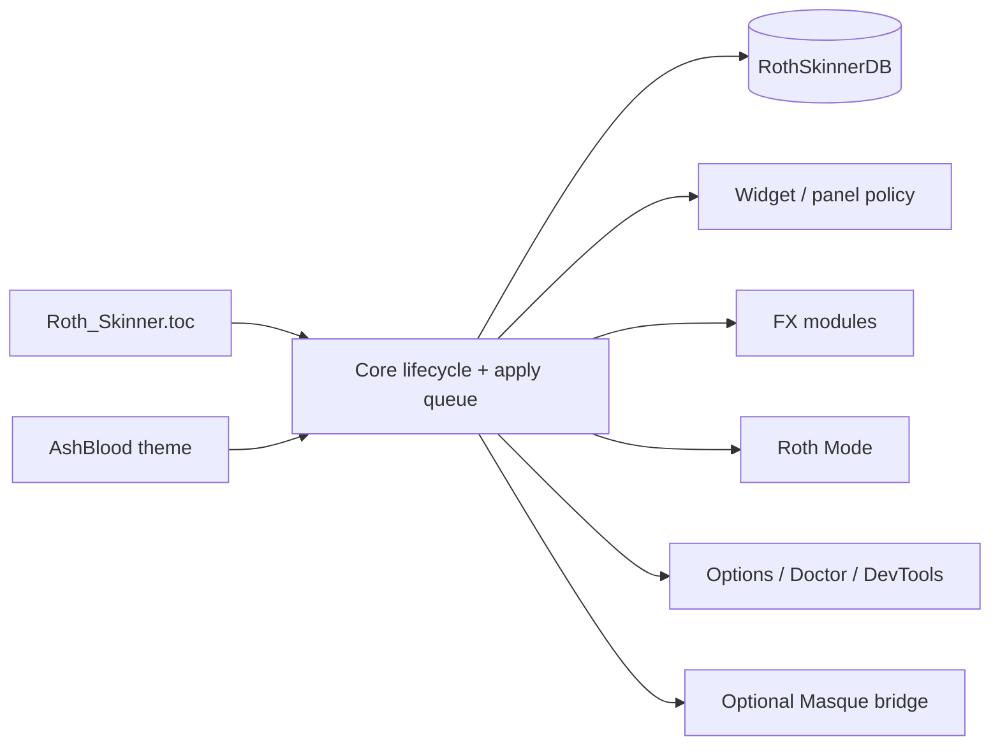

# Code graph

```mermaid
flowchart LR
  TOC["Roth_Skinner.toc"] --> Core["Core lifecycle + apply queue"]
  Core --> DB[("RothSkinnerDB")]
  Theme["AshBlood theme"] --> Core
  Core --> Policy["Widget / panel policy"]
  Core --> FX["FX modules"]
  Core --> Mode["Roth Mode"]
  Core --> UI["Options / Doctor / DevTools"]
  Core --> Masque["Optional Masque bridge"]
```
